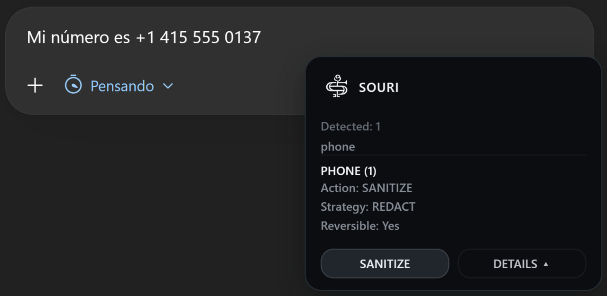
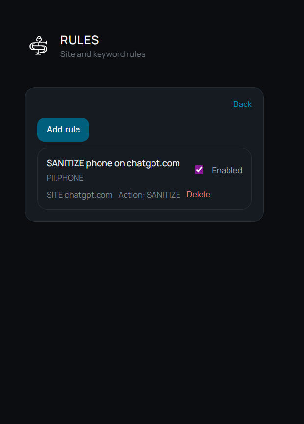

# SOURI Site

Public landing page for SOURI.

This repository contains the public-facing website used to present SOURI externally through a simple product site, screenshots, and product messaging.

## Live site

[souri-site.vercel.app](https://souri-site.vercel.app)

## About SOURI

SOURI is a privacy-first, local-first browser extension that helps protect sensitive data before it reaches AI tools.

It is designed to help users:

- detect sensitive data in active inputs
- sanitize before submission
- see visible in-context actions
- keep an audit trail of privacy events
- turn repeated actions into reusable rules

## Product preview

### Home


### Detection toast


### Sanitized input


### Audit history


### Create rule from audit


### Rules with created rule


## Local development

```bash
npm install
npm run dev
```

## Production build

```bash
npm run build
```

## Related repository

Main public product repository:

[github.com/daviscardenas2006/souri](https://github.com/daviscardenas2006/souri)
